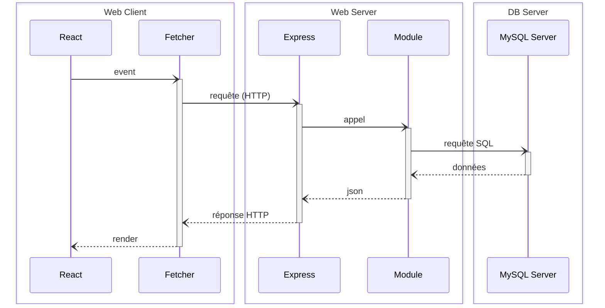
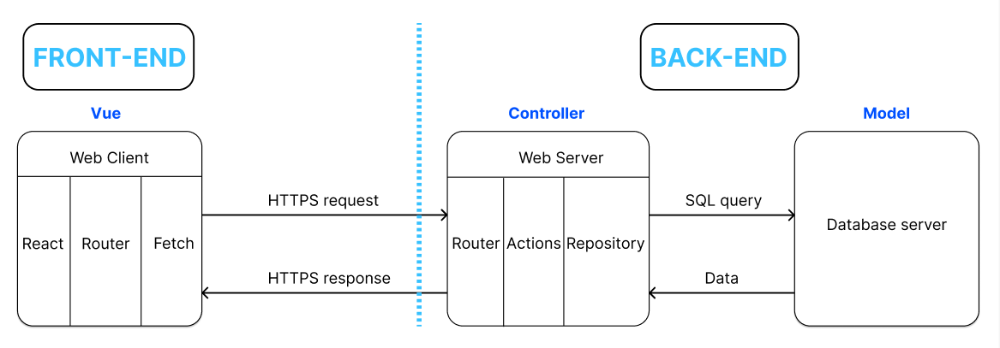

<a href="#fr">
   Français
</a>&nbsp;&nbsp;|&nbsp;&nbsp;
<a href="#en">
   English
</a>

<hr style="margin-top: 4px; margin-bottom: 12px; border: none; border-top: 1px solid #ccc;" />

 Français

<h1>Task Connect</h1>

Task Connect est une plateforme web collaborative qui met en relation des particuliers avec des prestataires de services du quotidien (bricolage, ménage, jardinage, aide à domicile, etc.).  
L'application permet de publier des tâches/missions, d'y répondre via des offres, de consulter des avis et de gérer les profils utilisateurs dans un environnement sécurisé.

Projet personnel réalisé en suivant une architecture MVC propre et modulaire.

Ce projet repose sur une stack moderne et une base de données relationnelle robuste avec des contraintes d’intégrité (clés étrangères, CHECK, ON DELETE CASCADE), permettant d’assurer la fiabilité des données et la scalabilité de l’application.

🔗 Découvrez le projet en ligne : [www.taskconnect.fr](http://www.taskconnect.fr)  

**💬 Vos avis m'intéressent - n'hésitez pas à me faire part de vos retours ou suggestions !** 

Ce projet est basé sur le monorepo JS proposé par la Wild Code School (v7.1.7), pré-configuré avec des outils de qualité industrielle :
- **Concurrently** : Exécution simultanée de plusieurs commandes dans un seul terminal
- **Husky** : Exécution de commandes spécifiques déclenchées par des événements Git
- **Vite** : Alternative performante à Create-React-App
- **Biome** : Alternative à ESLint et Prettier pour la qualité du code
- **Supertest** : Tests des serveurs HTTP en Node.js

## Schéma visuel de l'architecture du projet (MVC) 



<!--
<div align="center">
  
</div>
-->

<!--
<div align="center">
  
</div>
-->

<!--
<div align="center">
  
</div>
-->

<!--
## Flux de navigation de l'application
 
<div align="center">
  
</div>
Grâce à cette architecture modulaire et sécurisée, Smart Choice Hub assure une gestion efficace des données, une communication fluide entre le front-end et le back-end, et une évolutivité facilitée pour de futures améliorations. 
--> 

## Stack

- **Client** : React + TypeScript + Vite
- **Serveur** : Node.js + Express + MySQL
- **CSS3** : Styling avec CSS
- **Upload** : Gestion d’image via Multer
- **Authentification sécurisée** via JWT (cookie httpOnly + SameSite) et hashage argon2 (à implémenter bientôt)
- **Hébergement** : Frontend sur Netlify, Backend (API & base de données) sur Railway 

## Fonctionnalités principales

- Création, consultation, modification et suppression de tâches/tasks
- Upload d’image lors de la création de tâches
- Interface responsive adaptée aux écrans mobile et desktop
- Authentification sécurisée avec gestion de session (à implémenter bientôt)
- Système d’offres (un tasker peut répondre à une mission) (à implémenter bientôt)
- Avis et notation (avec contraintes de validité et protections anti-abus) (à implémenter bientôt)
- Accès restreint aux utilisateurs connectés (à implémenter bientôt)

## Démarrer le projet

### Utilisateurs Windows
Assurez-vous de lancer ces commandes dans un terminal Git pour éviter les problèmes de formats de nouvelles lignes :
```bash
git config --global core.eol lf
git config --global core.autocrlf false
```

### Installation
1. Installez le plugin **Biome** dans VSCode et configurez-le
2. Cloner le dépôt :
   ```bash
   git clone git@github.com:nadir-ammisaid/Task-Connect.git
   cd task-connect
   ```

3. Installer les dépendances :
   ```bash
   npm install
   ```

4. Configurer les fichiers `.env` :
   * Vous pouvez copier les fichiers `.env.sample` comme modèles (ne les supprimez pas)
   * `client/.env`
     ```
     VITE_API_URL=http://localhost:3310/api
     ```
   
   * `server/.env`
     ```
     DB_HOST=localhost
     DB_USER=root
     DB_PASSWORD=motdepasse
     DB_NAME=task_connect
     JWT_SECRET=supersecretkey
     FRONT_URL=http://localhost:5173
     ```

5. Lancer le projet :
   ```bash
   npm run dev
   ```

## Arborescence du projet (monorepo)

```
task-connect/
├── client/
│   ├── public/
│   └── src/
│       ├── assets/
│       ├── components/
│       ├── context/
│       ├── pages/
│       ├── services/
│       └── types/
│   ├── App.tsx
│   ├── main.tsx
│   ├── vite.config.ts
│   └── tsconfig.json
│
├── server/
│   ├── bin/
│   ├── database/
│   │   ├── fixtures/
│   │   ├── client.ts
│   │   └── schema.sql
│   ├── public/
│   │   ├── assets/
│   │   └── uploads/
│   ├── src/
│   │   ├── modules/
│   │   │   ├── task/
│   │   │   ├── user/
│   │   │   ├── offer/
│   │   │   ├── review/
│   │   │   └── category/
│   │   ├── types/
│   │   ├── app.ts
│   │   ├── main.ts
│   │   └── router.ts
│   ├── tests/
│   ├── jest.config.js
│   └── tsconfig.json
```

## Routes principales de l'API

| Méthode | Route                     | Description                      |
|---------|---------------------------|----------------------------------|
| GET     | `/api/tasks`              | Récupérer la liste des tâches    |
| POST    | `/api/tasks`              | Créer une tâche (avec image)     |
| GET     | `/api/tasks/:id`          | Détail d’une tâche               |
| PUT     | `/api/tasks/:id`          | Modifier une tâche existante     |
| DELETE  | `/api/tasks/:id`          | Supprimer une tâche existante    |
| DELETE  | `/api/tasks/:id`          | Suppression d’une tâche          |
| GET     | `/api/categories`         | Liste des catégories disponibles |
| ---     | ---                       | ---                              |
| bientôt:| ---                       | ---                              |
| ---     | ---                       | ---                              |
| POST    | `/api/login`              | Connexion utilisateur            |
| GET     | `/api/me`                 | Profil connecté                  |
| POST    | `/api/offers`             | Envoi d’une offre                |
| GET     | `/api/reviews/tasker/:id` | Avis pour un tasker              |
| POST    | `/api/reviews`            | Création d’un avis               |


## Variables d'environnement

### client/.env
```
VITE_API_URL=http://localhost:3310/api
```

### server/.env
```
DB_HOST=localhost
DB_USER=root
DB_PASSWORD=root
DB_NAME=task_connect
JWT_SECRET=supersecretkey
CLIENT_URL=http://localhost:3000
```

## Sécurité

- Requêtes SQL préparées via `mysql2/promise` 
- Authentification JWT stockée en cookie `httpOnly` avec `SameSite=Strict` (à implémenter bientôt)
- Hashage sécurisé des mots de passe avec **argon2** (à implémenter bientôt)
- Middleware `verifyToken` pour protéger les routes sensibles (à implémenter bientôt)
- Vérifications côté client et serveur (à implémenter bientôt)


## Auteur

Projet personnel développé en autonomie par [**Nadir AMMI SAID**](https://www.linkedin.com/in/nadir-ammisaid/), pour approfondir mes compétences en développement full-stack.
<br/>
🔗 Découvrez le projet en ligne : [www.taskconnect.fr](http://www.taskconnect.fr)

**💬 Vos avis m'intéressent - n'hésitez pas à me faire part de vos retours ou suggestions !**
<br/>
📩 Vous pouvez me contacter directement sur LinkedIn : [https://www.linkedin.com/in/nadir-ammisaid/](https://www.linkedin.com/in/nadir-ammisaid/)


## Contribution

Pour contribuer au projet :
1. **Fork** le dépôt
2. **Clone** votre fork sur votre machine locale
3. Créez une nouvelle branche pour votre fonctionnalité (`git switch -c feature/votre-fonctionnalite`)
4. **Commit** vos modifications (`git commit -m 'Ajout de fonctionnalité'`)
5. **Push** vers votre branche (`git push origin feature/votre-fonctionnalite`)
6. Créez une **Pull Request** sur le dépôt principal

**Bonnes pratiques** :
- Exécutez `npm run check` avant de pousser vos modifications
- Ajoutez des tests pour toute nouvelle fonctionnalité
- Suivez les principes SOLID pour une architecture de code propre et maintenable

<br/>
<hr id="en" style="margin-top: 4px; margin-bottom: 12px; border: none; border-top: 1px solid #ccc;" />
<br/>

 English

<h1>Task Connect</h1>

Task Connect is a collaborative web platform that connects individuals with everyday service providers (handyman, cleaning, gardening, home assistance, etc.).  
The application allows users to post tasks/missions, respond to them via offers, consult reviews, and manage user profiles in a secure environment.

Personal project built following a clean and modular MVC architecture.

This project relies on a modern stack and a robust relational database with integrity constraints (foreign keys, CHECK, ON DELETE CASCADE), ensuring data reliability and application scalability.

🔗 Discover the project online: [www.taskconnect.fr](http://www.taskconnect.fr)

**💬 Your feedback matters - don't hesitate to share your thoughts or suggestions!**

This project is based on the JS monorepo proposed by Wild Code School (v7.1.7), pre-configured with industrial quality tools:
- **Concurrently**: Simultaneous execution of multiple commands in a single terminal
- **Husky**: Execution of specific commands triggered by Git events
- **Vite**: High-performance alternative to Create-React-App
- **Biome**: Alternative to ESLint and Prettier for code quality
- **Supertest**: Testing of HTTP servers in Node.js

## Visual diagram of the project architecture (MVC)


<!--
<div align="center">
  
</div>
-->

<!--
## Application navigation flow

<div align="center">
  
</div>
Thanks to this modular and secure architecture, Smart Choice Hub ensures efficient data management, smooth communication between the front-end and back-end, and facilitated scalability for future improvements.
-->
## Stack

- **Client**: React + TypeScript + Vite
- **Server**: Node.js + Express + MySQL
- **CSS3**: Styling with CSS
- **Upload**: Image management via Multer
- **Secure authentication** via JWT (httpOnly cookie + SameSite) and argon2 hashing (to be implemented soon)
- **Hosting**: Frontend on Netlify, Backend (API & database) on Railway 

## Main Features

- Create, view, edit, and delete tasks
- Image upload when creating tasks
- Responsive interface adapted for mobile and desktop screens
- Secure authentication with session management (to be implemented soon)
- Offer system (a tasker can respond to a mission) (to be implemented soon)
- Reviews and ratings (with validity constraints and anti-abuse protections) (to be implemented soon)
- Restricted access for logged-in users (to be implemented soon)

## Getting Started

### Windows Users
Make sure to run these commands in a Git terminal to avoid line ending issues:
```bash
git config --global core.eol lf
git config --global core.autocrlf false
```

### Installation
1. Install the Biome plugin in VSCode and configure it
2. Clone the repository:
   ```bash
   git clone git@github.com:nadir-ammisaid/Task-Connect.git
   cd task-connect
   ```

3. Install dependencies:
   ```bash
   npm install
   ```

4. Configure `.env` files:
   * You can copy the `.env.sample` files as templates (do not delete them)
   * `client/.env`
     ```
     VITE_API_URL=http://localhost:3310/api
     ```
   
   * `server/.env`
     ```
     DB_HOST=localhost
     DB_USER=root
     DB_PASSWORD=password
     DB_NAME=task_connect
     JWT_SECRET=supersecretkey
     FRONT_URL=http://localhost:5173
     ```

5. Launch the project:
   ```bash
   npm run dev
   ```

## Arborescence du projet (monorepo)

```
task-connect/
├── client/
│   ├── public/
│   └── src/
│       ├── assets/
│       ├── components/
│       ├── context/
│       ├── pages/
│       ├── services/
│       └── types/
│   ├── App.tsx
│   ├── main.tsx
│   ├── vite.config.ts
│   └── tsconfig.json
│
├── server/
│   ├── bin/
│   ├── database/
│   │   ├── fixtures/
│   │   ├── client.ts
│   │   └── schema.sql
│   ├── public/
│   │   ├── assets/
│   │   └── uploads/
│   ├── src/
│   │   ├── modules/
│   │   │   ├── task/
│   │   │   ├── user/
│   │   │   ├── offer/
│   │   │   ├── review/
│   │   │   └── category/
│   │   ├── types/
│   │   ├── app.ts
│   │   ├── main.ts
│   │   └── router.ts
│   ├── tests/
│   ├── jest.config.js
│   └── tsconfig.json
```

## Routes principales de l'API

| Method  | Route                     | Description                      |
|---------|---------------------------|----------------------------------|
| GET     | `/api/tasks`              | Get task list                    |
| POST    | `/api/tasks`              | Create a task (with image)       |
| GET     | `/api/tasks/:id`          | Task details                     |
| PUT     | `/api/tasks/:id`          | Edit an existing task            |
| DELETE  | `/api/tasks/:id`          | Delete an existing task          |
| DELETE  | `/api/tasks/:id`          | Task deletion                    |
| GET     | `/api/categories`         | List of available categories     |
| ---     | ---                       | ---                              |
| soon   :| ---                       | ---                              |
| ---     | ---                       | ---                              |
| POST    | `/api/login`              | User login                       |
| GET     | `/api/me`                 | Connected profile                |
| POST    | `/api/offers`             | Submit an offer                  |
| GET     | `/api/reviews/tasker/:id` | Reviews for a tasker             |
| POST    | `/api/reviews`            | Create a review                  |


## Environment variables

### client/.env
```
VITE_API_URL=http://localhost:3310/api
```

### server/.env
```
DB_HOST=localhost
DB_USER=root
DB_PASSWORD=root
DB_NAME=task_connect
JWT_SECRET=mySuperSecret
CLIENT_URL=http://localhost:3000
```

## Sécurité

- Prepared SQL queries via `mysql2/promise`
- JWT authentication stored in `httpOnly` cookie with `SameSite=Strict` (to be implemented soon)
- Secure password hashing with **argon2** (to be implemented soon)
- `verifyToken` middleware to protect sensitive routes (to be implemented soon)
- Client and server-side validations (to be implemented soon)


## Author

Personal project independently developed by [**Nadir AMMI SAID**](https://www.linkedin.com/in/nadir-ammisaid/) to deepen my full-stack development skills.
<br/>
🔗 Discover the project online: [www.taskconnect.fr](http://www.taskconnect.fr)

**💬 Your feedback matters - don't hesitate to share your thoughts or suggestions!**
<br/>
📩 You can contact me directly on LinkedIn: [https://www.linkedin.com/in/nadir-ammisaid/](https://www.linkedin.com/in/nadir-ammisaid/)


## Contribution 

To contribute to the project:
1. **Fork** the repository
2. **Clone** your fork to your local machine
3. Create a new branch for your feature (`git switch -c feature/your-feature`)
4. **Commit** your changes (`git commit -m 'Add feature'`)
5. **Push** to your branch (`git push origin feature/your-feature`)
6. Create a **Pull Request** on the main repository

**Best practices**:
- Run `npm run check` before pushing your changes
- Add tests for any new feature
- Follow SOLID principles for clean and maintainable code architecture


<!--  Readme original du Monorepo JS de Wild Code School

# Readme original du Monorepo JS de Wild Code School

# checkpoint4

Ce projet est un monorepo JS, suivant l'architecture React-Express-MySQL telle qu'enseignée à la Wild Code School (v7.1.7) :


Il est pré-configuré avec un ensemble d'outils pour aider les étudiants à produire du code de qualité industrielle, tout en restant un outil pédagogique :

- **Concurrently** : Permet d'exécuter plusieurs commandes simultanément dans le même terminal.
- **Husky** : Permet d'exécuter des commandes spécifiques déclenchées par des événements _git_.
- **Vite** : Alternative à _Create-React-App_, offrant une expérience plus fluide avec moins d'outils.
- **Biome** : Alternative à _ESlint_ et _Prettier_, assurant la qualité du code selon des règles choisies.
- **Supertest** : Bibliothèque pour tester les serveurs HTTP en node.js.

## Table des Matières

- [checkpoint4](#name)
  - [Table des Matières](#table-des-matières)
  - [Utilisateurs Windows](#utilisateurs-windows)
  - [Installation \& Utilisation](#installation--utilisation)
  - [Les choses à retenir](#les-choses-à-retenir)
    - [Commandes de Base](#commandes-de-base)
    - [Structure des Dossiers](#structure-des-dossiers)
    - [Mettre en place la base de données](#mettre-en-place-la-base-de-données)
    - [Développer la partie back-end](#développer-la-partie-back-end)
    - [REST](#rest)
    - [Autres Bonnes Pratiques](#autres-bonnes-pratiques)
  - [FAQ](#faq)
    - [Déploiement avec Traefik](#déploiement-avec-traefik)
    - [Variables d'environnement spécifiques](#variables-denvironnement-spécifiques)
    - [Logs](#logs)
    - [Contribution](#contribution)

## Utilisateurs Windows

Assurez-vous de lancer ces commandes dans un terminal Git pour éviter [les problèmes de formats de nouvelles lignes](https://en.wikipedia.org/wiki/Newline#Issues_with_different_newline_formats) :

```sh
git config --global core.eol lf
git config --global core.autocrlf false
```

## Installation & Utilisation

1. Installez le plugin **Biome** dans VSCode et configurez-le.
2. Clonez ce dépôt, puis accédez au répertoire cloné.
3. Exécutez la commande `npm install`.
4. Créez des fichiers d'environnement (`.env`) dans les répertoires `server` et `client` : vous pouvez copier les fichiers `.env.sample` comme modèles (**ne les supprimez pas**).

## Les choses à retenir

### Commandes de Base

| Commande               | Description                                                                 |
|------------------------|-----------------------------------------------------------------------------|
| `npm install`          | Installe les dépendances pour le client et le serveur                       |
| `npm run db:migrate`   | Met à jour la base de données à partir d'un schéma défini                   |
| `npm run dev`          | Démarre les deux serveurs (client et serveur) dans un seul terminal         |
| `npm run check`        | Exécute les outils de validation (linting et formatage)                     |
| `npm run test`         | Exécute les tests unitaires et d'intégration                                |

### Structure des Dossiers

```plaintext
my-project/
│
├── server/
│   ├── app/
│   │   ├── modules/
│   │   │   ├── item/
│   │   │   │   ├── itemActions.ts
│   │   │   │   └── itemRepository.ts
│   │   │   └── ...
│   │   ├── app.ts
│   │   ├── main.ts
│   │   └── router.ts
│   ├── database/
│   │   ├── client.ts
│   │   └── schema.sql
│   ├── tests/
│   ├── .env
│   └── .env.sample
│
└── client/
    ├── src/
    │   ├── components/
    │   ├── pages/
    │   └── App.tsx
    ├── .env
    └── .env.sample
```

### Mettre en place la base de données

**Créer et remplir le fichier `.env`** dans le dossier `server` :

```plaintext
DB_HOST=localhost
DB_PORT=3306
DB_USER=not_root
DB_PASSWORD=password
DB_NAME=my_database
```

**Les variables sont utilisés** dans `server/database/client.ts` :

```typescript
const { DB_HOST, DB_PORT, DB_USER, DB_PASSWORD, DB_NAME } = process.env;

import mysql from "mysql2/promise";

const client = mysql.createPool({
  host: DB_HOST,
  port: DB_PORT as number | undefined,
  user: DB_USER,
  password: DB_PASSWORD,
  database: DB_NAME,
});

export default client;
```

**Créer une table** dans `server/database/schema.sql` :

```sql
CREATE TABLE item (
  id INT AUTO_INCREMENT PRIMARY KEY,
  title VARCHAR(255) NOT NULL,
  user_id INT NOT NULL,
  FOREIGN KEY(user_id) REFERENCES user(id)
);
```

**Insérer des données** dans `server/database/schema.sql` :

```sql
INSERT INTO item (title, user_id) VALUES
  ('Sample Item 1', 1),
  ('Sample Item 2', 2);
```

**Synchroniser la BDD avec le schema** :

```sh
npm run db:migrate
```

### Développer la partie back-end

**Créer une route** dans `server/app/router.ts` :

```typescript
// ...

/* ************************************************************************* */
// Define Your API Routes Here
/* ************************************************************************* */

// Define item-related routes
import itemActions from "./modules/item/itemActions";

router.get("/api/items", itemActions.browse);

/* ************************************************************************* */

// ...
```

**Définir une action** dans `server/app/modules/item/itemActions.ts` :

```typescript
import type { RequestHandler } from "express";

import itemRepository from "./itemRepository";

const browse: RequestHandler = async (req, res, next) => {
  try {
    const items = await itemRepository.readAll();

    res.json(items);
  } catch (err) {
    next(err);
  }
};

export default { browse };
```

**Accéder aux données** dans `server/app/modules/item/itemRepository.ts` :

```typescript
import databaseClient from "../../../database/client";

import type { Result, Rows } from "../../../database/client";

interface Item {
  id: number;
  title: string;
  user_id: number;
}

class ItemRepository {
  async readAll() {
    const [rows] = await databaseClient.query<Rows>("select * from item");

    return rows as Item[];
  }
}

export default new ItemRepository();
```

**Ajouter un middleware** 

```typescript
// ...

/* ************************************************************************* */
// Define Your API Routes Here
/* ************************************************************************* */

// Define item-related routes
import itemActions from "./modules/item/itemActions";

const foo: RequestHandler = (req, res, next) => {
  req.message = "hello middleware";

  next();
}

router.get("/api/items", foo, itemActions.browse);

/* ************************************************************************* */

// ...
```

`req.message` sera disponible dans `itemActions.browse`.

⚠️ La propriété `message` doit être ajoutée dans `src/types/express/index.d.ts` :

```diff
// to make the file a module and avoid the TypeScript error
export type {};

declare global {
  namespace Express {
    export interface Request {
      /* ************************************************************************* */
      // Add your custom properties here, for example:
      //
      // user?: { ... };
      /* ************************************************************************* */
+      message: string;
    }
  }
}
```

### REST

| Opération | Méthode | Chemin d'URL | Corps de la requête | SQL    | Réponse (Succès)               | Réponse (Erreur)                                                       |
|-----------|---------|--------------|---------------------|--------|--------------------------------|------------------------------------------------------------------------|
| Browse    | GET     | /items       |                     | SELECT | 200 (OK), liste des items.     |                                                                        |
| Read      | GET     | /items/:id   |                     | SELECT | 200 (OK), un item.             | 404 (Not Found), si id invalide.                                       |
| Add       | POST    | /items       | Données de l'item   | INSERT | 201 (Created), id d'insertion. | 400 (Bad Request), si corps invalide.                                  |
| Edit      | PUT     | /items/:id   | Données de l'item   | UPDATE | 204 (No Content).              | 400 (Bad Request), si corps invalide. 404 (Not Found), si id invalide. |
| Destroy   | DELETE  | /items/:id   |                     | DELETE | 204 (No Content).              | 404 (Not Found), si id invalide.                                       |

### Autres Bonnes Pratiques

- **Sécurité** :
  - Validez et échappez toujours les entrées des utilisateurs.
  - Utilisez HTTPS pour toutes les communications réseau.
  - Stockez les mots de passe de manière sécurisée en utilisant des hash forts (ex : argon2).
  - Revoyez et mettez à jour régulièrement les dépendances.

- **Code** :
  - Suivez les principes SOLID pour une architecture de code propre et maintenable.
  - Utilisez TypeScript pour bénéficier de la vérification statique des types.
  - Adoptez un style de codage cohérent avec Biome.
  - Écrivez des tests pour toutes les fonctionnalités critiques.

## FAQ

### Déploiement avec Traefik

> ⚠️ Prérequis : Vous devez avoir installé et configuré Traefik sur votre VPS au préalable. Suivez les instructions ici : [VPS Traefik Starter Kit](https://github.com/WildCodeSchool/vps-traefik-starter-kit/).

Pour le déploiement, ajoutez les secrets suivants dans la section `secrets` → `actions` du dépôt GitHub :

- `SSH_HOST` : Adresse IP de votre VPS
- `SSH_USER` : Identifiant SSH pour votre VPS
- `SSH_PASSWORD` : Mot de passe de connexion SSH pour votre VPS

Et une variable publique dans `/settings/variables/actions` :

- `PROJECT_NAME` : Le nom du projet utilisé pour créer le sous-domaine.

> ⚠️ Avertissement : Les underscores ne sont pas autorisés car ils peuvent causer des problèmes avec le certificat Let's Encrypt.

L'URL de votre projet sera `https://${PROJECT-NAME}.${subdomain}.wilders.dev/`.

### Variables d'environnement spécifiques

Les étudiants doivent utiliser le modèle fourni dans le fichier `*.env.sample*` en suivant la convention `<PROJECT_NAME><SPECIFIC_NAME>=<THE_VARIABLE>`.

> ⚠️ **Avertissement:** Le `PROJECT_NAME` doit correspondre à celui utilisé dans la variable publique Git.

Pour l'ajouter lors du déploiement, suivez ces deux étapes :

1. Ajoutez la variable correspondante dans le fichier `docker-compose.prod.yml` (comme montré dans l'exemple : `PROJECT_NAME_SPECIFIC_NAME: ${PROJECT_NAME_SPECIFIC_NAME}`).
2. Connectez-vous à votre serveur via SSH. Ouvrez le fichier `.env` global dans Traefik (`nano ./traefik/data/.env`). Ajoutez la variable avec la valeur correcte et sauvegardez le fichier.

Après cela, vous pouvez lancer le déploiement automatique. Docker ne sera pas rafraîchi pendant ce processus.

### Logs

Pour accéder aux logs de votre projet en ligne (pour suivre le déploiement ou surveiller les erreurs), connectez-vous à votre VPS (`ssh user@host`). Ensuite, allez dans votre projet spécifique et exécutez `docker compose logs -t -f`.

### Contribution

Nous accueillons avec plaisir les contributions ! Veuillez suivre ces étapes pour contribuer :

1. **Fork** le dépôt.
2. **Clone** votre fork sur votre machine locale.
3. Créez une nouvelle branche pour votre fonctionnalité ou bug fix (`git switch -c feature/your-feature-name`).
4. **Commit** vos modifications (`git commit -m 'Add some feature'`).
5. **Push** vers votre branche (`git push origin feature/your-feature-name`).
6. Créez une **Pull Request** sur le dépôt principal.

**Guide de Contribution** :

- Assurez-vous que votre code respecte les standards de codage en exécutant `npm run check` avant de pousser vos modifications.
- Ajoutez des tests pour toute nouvelle fonctionnalité ou correction de bug.
- Documentez clairement vos modifications dans la description de la pull request.
--> 
